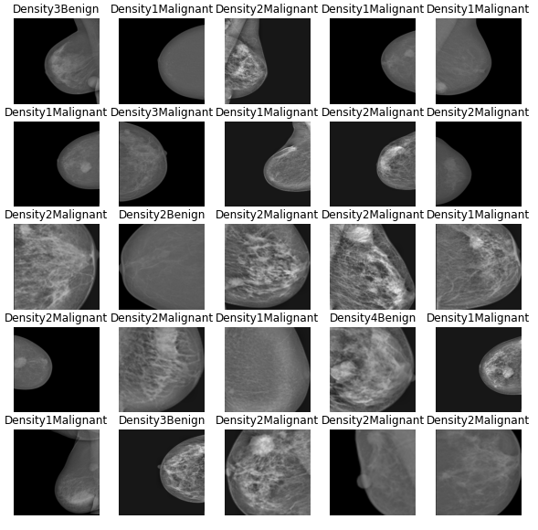

# VisionProject
Breast cancer vision detection using Tensorflow, training VGG19, Inception and a custom Neural Network.  
The Daset (http://dx.doi.org/10.17632/x7bvzv6cvr.1) contains 213 different mammographies (taken from INbreast database) labeled with 8 different classes.  

  
For more info, look at the [presentation]('./Vision\ and\ Perception\ Final\ Project.pdf').
